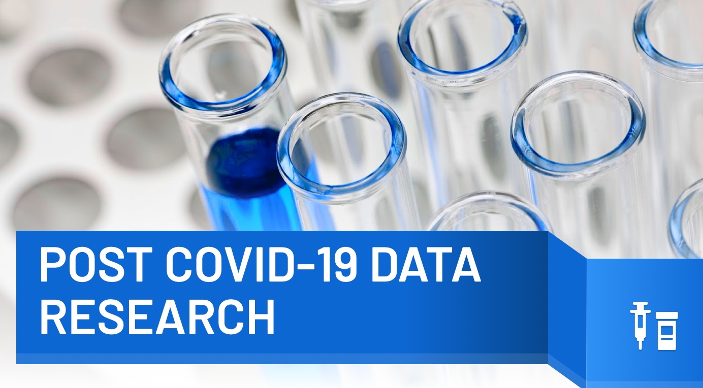

# Moringa-Week-5-Project

## This is the Moringa Project for Week 5 of Prep

The project is conducting a research on the post pandemic effects of the corona virus 
pandemic of 2019 to 2022. It seeks to identify the countries hard hit by the pandemic
i.e economically and also by the number of deaths and also the regions with low vaccine supply
and the data is to be used to advice the Royal Statistical Society, to cushion the negative effects of the pandemic.

